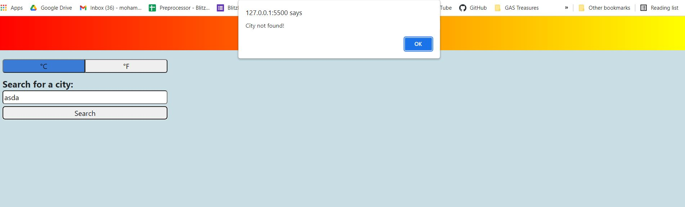

# Smart-Weather-App
A weather app that helps you check the weather in various locations

### Built With

* HTML5
* CSS3
* JavaScript ES6
* jQuery
* Bootstrap

## Highlights

* Connected to Open Weather API to get the latest weather info for a given location as well as forecasts
* Can flip between metric and imperial units
* Bookmarks cities that were searched before
* Responsive Design

## Features

* Displays Current Weather info on the looked up city with icon
* Displays 5 days forecast that follows the current day including weather icons
* Bookmarks saved cities, up to 6 last searched ones, then starts replacing them
* Wrong city names alerts the user that the city does not exist
* Toggle buttons that can convert between imperal and mertic units
* Clicking on bookmark buttons snaps to Weather Info Section
* Displays UV Index from a second API call and highlights it with a color based on severity

## Getting Started

This is an example of how you may give instructions on setting up your project locally.
To get a local copy up and running follow these simple example steps.

### Prerequisites

* jQuery resources
* Bootstrap resources

### Installation

Not Required.

## Screenshots of product journey

#### Searching a city gets the weather data and forecast

#### Wrong city name search alerts the user

#### Switching between different units (Metric to Impertial)

#### API Data is saved in local Storage

#### UV Index fetched from another API call, highlighted with color based on severity

